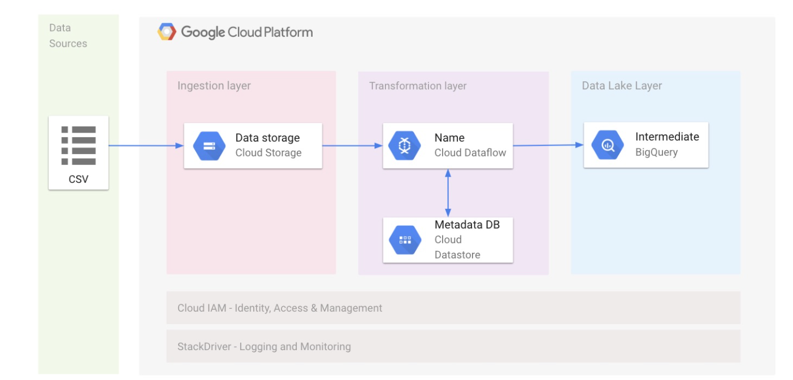
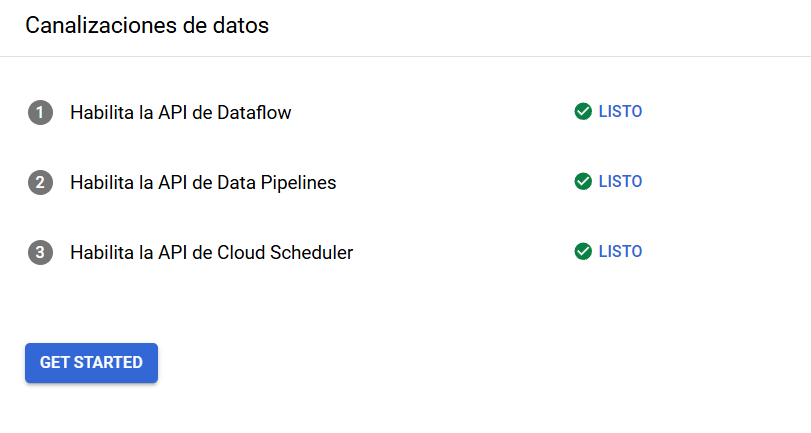
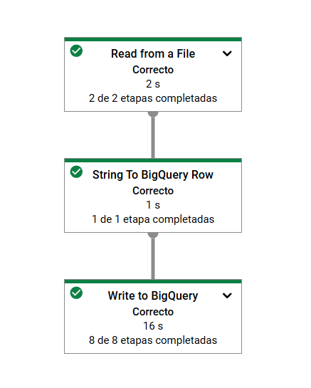
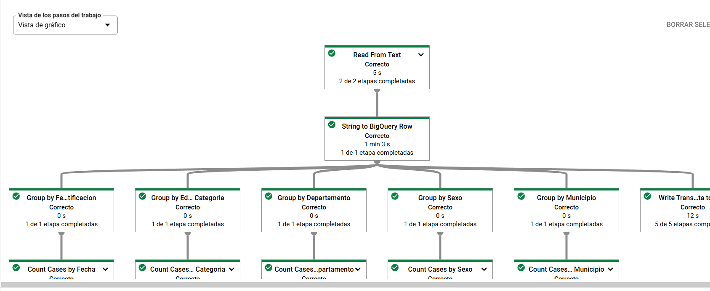
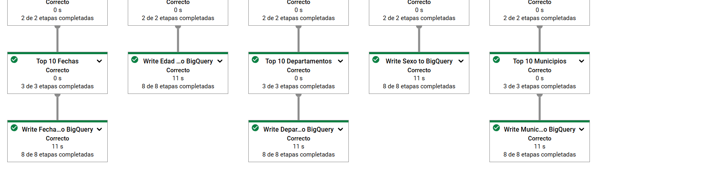
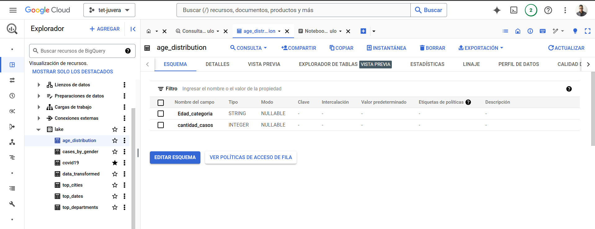

# **ST0263 Tópicos Especiales en Telemática**
***********
# **Estudiantes**: Samuel Garcia Correa, Sgarciac6@eafit.edu.co - Juan Andres Vera Alvarez, javeraa@eafit.edu.co
***********
# **Profesor**: ALVARO ENRIQUE OSPINA SANJUAN , aeospinas@eafit.brightspace.com
***********
# Proyecto 3 - BIGDATA
#
# 1. breve descripción de la actividad

<texto descriptivo>
Automatizar procesos ETL mediante Steps para la ingestión de los datos, posteriormente manipularlos a las reglas de negocio que se tuvieron consideradas para el laboratorio 3, y almacenarlos posteriormente en una zona de resultados, con la posibilidad de realizar consultas externaas

## Requisitos completados
<texto descriptivo>
•	Se creo pipeline para la ingestión de los datos recibidos del covid ya sea por base de datos, o ruta de Archivo.

•	El sistema permite la consultas externas a través del uso de un api de notebooks.
•	Se creo pipeline para la manipulación de los datos y los tipos de datos.
•	Se realizan ejercicios de manera automatizada del lab3 planteado.

## Requisitos NO completados
<texto descriptivo>
Se pudo resolver todos los puntos planteados, sin embargo, fue a través de Google cloud platform debido a que es una alternativa bastante atractiva, y fue de dominio para el equipo

# 2. información general de diseño de alto nivel, arquitectura, patrones, mejores prácticas utilizadas.






# 3. Descripción del ambiente de desarrollo y técnico:

## herramientas usadas:
- google cloud platform
- python
- Cloud Storage
- Dataflow
- BigQuery

## Tarea 1: Asegúrate de que la API de Dataflow esté habilitada correctamente
Para garantizar el acceso a la API necesaria, reinicia la conexión a la API de Dataflow.

## Importante: 
Incluso si la API ya está habilitada, sigue los pasos del 1 al 4 que se indican más abajo para inhabilitarla y, luego, vuelve a habilitarla para reiniciar la API correctamente.

- En la consola de Cloud, ingresa “API de Dataflow” en la barra de búsqueda superior. Haz clic en el resultado de API de Dataflow.

- Haz clic en Administrar.

- Haz clic en Inhabilitar API.

- Si se te solicita confirmar, haz clic en Inhabilitar.

- Haz clic en Habilitar.
- Cuando se haya habilitado de nuevo la API, se mostrará en la página la opción para inhabilitarla.

## Tarea 2: Descarga el código de partida
1.Ejecuta el siguiente comando en Cloud Shell para obtener ejemplos de Dataflow para Python.

    gsutil -m cp -R gs://spls/gsp290/dataflow-python-examples .

2.Ahora, en Cloud Shell, establece una variable igual a tu ID del proyecto:

    export PROJECT=tet-juvera

    gcloud config set project $PROJECT

## Tarea 3. Crea un bucket de Cloud Storage
1.Usa el comando correspondiente en Cloud Shell para crear un nuevo bucket regional en la región

    gsutil mb -c regional -l us-central1 gs://$PROJECT

2.clona el repositorio https://github.com/st0263eafit/st0263-242 para buscar los archivos de datasets

    git clone https://github.com/st0263eafit/st0263-242

## Tarea 4: Copia archivos al bucket
Usa el comando gsutil en Cloud Shell para copiar archivos al bucket de Cloud Storage que acabas de crear

    gsutil cp /home/juanandresvera1/st0263-242/bigdata/datasets/covid19/Casos_positivos_de_COVID-19_en_Colombia-1K.csv gs://$PROJECT/data_files/

    gsutil cp /home/juanandresvera1/st0263-242/bigdata/datasets/covid19/Casos_positivos_de_COVID-19_en_Colombia-100K.csv gs://$PROJECT/data_files/

## Tarea 5: Crea un conjunto de datos de BigQuery
En Cloud Shell, crea un conjunto de datos en BigQuery llamado lake. Todas tus tablas se cargarán en BigQuery aquí:

    bq mk lake

## Tarea 6: Crea una canalización de Dataflow
Para este paso es muy importante editar los archivos de ejemplo a nuestra necesidad

- Abre el editor de código de Cloud Shell
Haz clic en el ícono Abrir editor para navegar al código


- Si se te solicita, haz clic en Abrir en una nueva ventana. Se abrirá el editor de código en una ventana nueva. El editor de Cloud Shell te permite editar archivos en el entorno de Cloud Shell. Desde el Editor, puedes hacer clic en Abrir terminal para volver a Cloud Shell.

- En el Editor de código, navega a dataflow-python-examples > dataflow_python_examples y abre los archivos: *data_ingestion.py, data_transformation.py, y data_transformation2.py*
- los modificamos de esta forma (y modificar el proyecto-ID y lake de datos): 

```python
## data_ingestion.py
import argparse
import logging
import re
import apache_beam as beam
from apache_beam.options.pipeline_options import PipelineOptions


class DataIngestion:
    """A helper class which contains the logic to translate the file into
    a format BigQuery will accept."""
    def parse_method(self, string_input):
        # Strip out carriage return, newline and quote characters.
        values = re.split(",",
                          re.sub('\r\n', '', re.sub('"', '', string_input)))
        row = dict(
            zip(('fecha_reporte_web','ID_de_caso','Fecha_de_notificacion','Codigo_DIVIPOLA_departamento','Nombre_departamento',
                'Codigo_DIVIPOLA_municipio','Nombre_municipio','Edad','Unidad_de_medida_de_edad','Sexo','Tipo_de_contagio',
                'Ubicacion_del_caso','Estado','Codigo_ISO_del_pais','Nombre_del_pais','Recuperado','Fecha_de_inicio_de_sintomas',
                'Fecha_de_muerte','Fecha_de_diagnostico','Fecha_de_recuperacion','Tipo_de_recuperacion','Pertenencia_etnica',
                'Nombre_del_grupo_etnico'),
                values))
        return row


def run(argv=None):
    """The main function which creates the pipeline and runs it."""

    parser = argparse.ArgumentParser()

    # Here we add some specific command line arguments we expect.
    # Specifically we have the input file to read and the output table to write.
    # This is the final stage of the pipeline, where we define the destination
    # of the data. In this case we are writing to BigQuery.
    parser.add_argument(
        '--input',
        dest='input',
        required=False,
        help='Input file to read. This can be a local file or '
        'a file in a Google Storage Bucket.',
        # This example file contains a total of only 10 lines.
        # Useful for developing on a small set of data.
        default='gs://tet-juvera/data_files/Casos_positivos_de_COVID-19_en_Colombia-100K.csv')

    # This defaults to the lake dataset in your BigQuery project. You'll have
    # to create the lake dataset yourself using this command:
    # bq mk lake
    parser.add_argument('--output',
                        dest='output',
                        required=False,
                        help='Output BQ table to write results to.',
                        default='lake.covid19')

    # Parse arguments from the command line.
    known_args, pipeline_args = parser.parse_known_args(argv)

    # DataIngestion is a class we built in this script to hold the logic for
    # transforming the file into a BigQuery table.
    data_ingestion = DataIngestion()

    # Initiate the pipeline using the pipeline arguments passed in from the
    # command line. This includes information such as the project ID and
    # where Dataflow should store temp files.
    p = beam.Pipeline(options=PipelineOptions(pipeline_args))

    (p
     # Read the file. This is the source of the pipeline. All further
     # processing starts with lines read from the file. We use the input
     # argument from the command line. We also skip the first line which is a
     # header row.
     | 'Read from a File' >> beam.io.ReadFromText(known_args.input,
                                                  skip_header_lines=1)
     # This stage of the pipeline translates from a CSV file single row
     # input as a string, to a dictionary object consumable by BigQuery.
     # It refers to a function we have written. This function will
     # be run in parallel on different workers using input from the
     # previous stage of the pipeline.
     | 'String To BigQuery Row' >>
     beam.Map(lambda s: data_ingestion.parse_method(s))
     | 'Write to BigQuery' >> beam.io.Write(
         beam.io.BigQuerySink(
             # The table name is a required argument for the BigQuery sink.
             # In this case we use the value passed in from the command line.
             known_args.output,
             # Here we use the simplest way of defining a schema:
             # fieldName:fieldType
             schema='fecha_reporte_web:STRING,ID_de_caso:STRING,Fecha_de_notificacion:STRING,'
             'Codigo_DIVIPOLA_departamento:STRING,Nombre_departamento:STRING,Codigo_DIVIPOLA_municipio:STRING,'
             'Nombre_municipio:STRING,Edad:STRING,Unidad_de_medida_de_edad:STRING,Sexo:STRING,Tipo_de_contagio:STRING,'
             'Ubicacion_del_caso:STRING,Estado:STRING,Codigo_ISO_del_pais:STRING,Nombre_del_pais:STRING,Recuperado:STRING,'
             'Fecha_de_inicio_de_sintomas:STRING,Fecha_de_muerte:STRING,Fecha_de_diagnostico:STRING,Fecha_de_recuperacion:STRING,'
             'Tipo_de_recuperacion:STRING,Pertenencia_etnica:STRING,Nombre_del_grupo_etnico:STRING',
             
             # Creates the table in BigQuery if it does not yet exist.
             create_disposition=beam.io.BigQueryDisposition.CREATE_IF_NEEDED,
             # Deletes all data in the BigQuery table before writing.
             write_disposition=beam.io.BigQueryDisposition.WRITE_TRUNCATE)))
    p.run().wait_until_finish()


if __name__ == '__main__':
    logging.getLogger().setLevel(logging.INFO)
    run()

```
----
```python
## data_transformation.py
import argparse
import logging
import apache_beam as beam
from apache_beam.options.pipeline_options import PipelineOptions
from apache_beam.io.gcp.bigquery_tools import parse_table_schema_from_json
from datetime import datetime
import csv
import os

class DataTransformation:
    def __init__(self):
        # Esquema actualizado sin espacios
        self.schema_str = '{"fields": [' \
                          '{"name": "fecha_reporte_web", "type": "DATE"},' \
                          '{"name": "ID_de_caso", "type": "INTEGER"},' \
                          '{"name": "Fecha_de_notificacion", "type": "DATE"},' \
                          '{"name": "Codigo_DIVIPOLA_departamento", "type": "INTEGER"},' \
                          '{"name": "Nombre_departamento", "type": "STRING"},' \
                          '{"name": "Codigo_DIVIPOLA_municipio", "type": "INTEGER"},' \
                          '{"name": "Nombre_municipio", "type": "STRING"},' \
                          '{"name": "Edad", "type": "INTEGER"},' \
                          '{"name": "Unidad_de_medida_de_edad", "type": "INTEGER"},' \
                          '{"name": "Sexo", "type": "STRING"},' \
                          '{"name": "Tipo_de_contagio", "type": "STRING"},' \
                          '{"name": "Ubicacion_del_caso", "type": "STRING"},' \
                          '{"name": "Estado", "type": "STRING"},' \
                          '{"name": "Codigo_ISO_del_pais", "type": "STRING"},' \
                          '{"name": "Nombre_del_pais", "type": "STRING"},' \
                          '{"name": "Recuperado", "type": "STRING"},' \
                          '{"name": "Fecha_de_inicio_de_sintomas", "type": "DATE"},' \
                          '{"name": "Fecha_de_muerte", "type": "DATE"},' \
                          '{"name": "Fecha_de_diagnostico", "type": "DATE"},' \
                          '{"name": "Fecha_de_recuperacion", "type": "DATE"},' \
                          '{"name": "Tipo_de_recuperacion", "type": "STRING"},' \
                          '{"name": "Pertenencia_etnica", "type": "INTEGER"},' \
                          '{"name": "Nombre_del_grupo_etnico", "type": "STRING"},' \
                          '{"name": "Edad_categoria", "type": "STRING"}]}'

    def parse_method(self, string_input):
        schema = parse_table_schema_from_json(self.schema_str)

        field_map = [f for f in schema.fields]

        # Use a CSV Reader which can handle quoted strings etc.
        reader = csv.reader(string_input.split('\n'))
        for csv_row in reader:
            row = {}
            # Iterate over the values from our csv file, applying any transformation logic.
            for i,value in enumerate(csv_row):
                field_name = field_map[i].name
                field_type = field_map[i].type
                
                if field_type == 'DATE':
                    try:
                        if value.strip():
                            fecha_datetime = datetime.strptime(value, "%d/%m/%Y %H:%M:%S")
                            value = fecha_datetime.strftime("%Y-%m-%d")
                    except ValueError as e:
                        logging.warning(f"Error al procesar la fecha: {value}. Error: {e}")
                        value = None
                
                try:
                    edad = int(row.get("Edad", 0)) 
                    row["Edad_categoria"] = "Menor" if edad < 18 else "Adulto"
                except ValueError as e:
                    logging.warning(f"Error al procesar la edad: {row.get('Edad')}. Error: {e}")
                    row["Edad_categoria"] = None

                row[field_map[i].name] = value
        return row


def run(argv=None):
    """The main function which creates the pipeline and runs it."""
    parser = argparse.ArgumentParser()
    # Here we add some specific command line arguments we expect.   Specifically
    # we have the input file to load and the output table to write to.
    parser.add_argument(
        '--input',
        dest='input',
        required=False,
        help='Input file to read.  This can be a local file or '
        'a file in a Google Storage Bucket.',
        # This example file contains a total of only 10 lines.
        # It is useful for developing on a small set of data
        default='gs://tet-juvera/data_files/Casos_positivos_de_COVID-19_en_Colombia-100K.csv')
    # This defaults to the temp dataset in your BigQuery project.  You'll have
    # to create the temp dataset yourself using bq mk temp
    parser.add_argument('--output',
                        dest='output',
                        required=False,
                        help='Output BQ table to write results to.',
                        default='lake.data_transformed')

    # Parse arguments from the command line.
    known_args, pipeline_args = parser.parse_known_args(argv)
    # DataTransformation is a class we built in this script to hold the logic for
    # transforming the file into a BigQuery table.
    data_ingestion = DataTransformation()

    # Initiate the pipeline using the pipeline arguments passed in from the
    # command line.  This includes information like where Dataflow should
    # store temp files, and what the project id is.
    p = beam.Pipeline(options=PipelineOptions(pipeline_args))
    schema = parse_table_schema_from_json(data_ingestion.schema_str)

    (p
     # Read the file.  This is the source of the pipeline.  All further
     # processing starts with lines read from the file.  We use the input
     # argument from the command line.  We also skip the first line which is a
     # header row.
     | 'Read From Text' >> beam.io.ReadFromText(known_args.input,
                                                skip_header_lines=1)
     # This stage of the pipeline translates from a CSV file single row
     # input as a string, to a dictionary object consumable by BigQuery.
     # It refers to a function we have written.  This function will
     # be run in parallel on different workers using input from the
     # previous stage of the pipeline.
     | 'String to BigQuery Row' >>
     beam.Map(lambda s: data_ingestion.parse_method(s)) |
     'Write to BigQuery' >> beam.io.Write(
         beam.io.BigQuerySink(
             # The table name is a required argument for the BigQuery sink.
             # In this case we use the value passed in from the command line.
             known_args.output,
             # Here we use the JSON schema read in from a JSON file.
             # Specifying the schema allows the API to create the table correctly if it does not yet exist.
             schema=schema,
             # Creates the table in BigQuery if it does not yet exist.
             create_disposition=beam.io.BigQueryDisposition.CREATE_IF_NEEDED,
             # Deletes all data in the BigQuery table before writing.
             write_disposition=beam.io.BigQueryDisposition.WRITE_TRUNCATE)))
    p.run().wait_until_finish()

if __name__ == '__main__':
    logging.getLogger().setLevel(logging.INFO)
    run()
```
****
```python
## data_transformation2.py
import argparse
import logging
import apache_beam as beam
from apache_beam.options.pipeline_options import PipelineOptions
from apache_beam.io.gcp.bigquery_tools import parse_table_schema_from_json
from datetime import datetime
import csv

class DataTransformation:
    def __init__(self):
        self.schema_str = '{"fields": [' \
                          '{"name": "fecha_reporte_web", "type": "DATE"},' \
                          '{"name": "ID_de_caso", "type": "INTEGER"},' \
                          '{"name": "Fecha_de_notificacion", "type": "DATE"},' \
                          '{"name": "Codigo_DIVIPOLA_departamento", "type": "INTEGER"},' \
                          '{"name": "Nombre_departamento", "type": "STRING"},' \
                          '{"name": "Codigo_DIVIPOLA_municipio", "type": "INTEGER"},' \
                          '{"name": "Nombre_municipio", "type": "STRING"},' \
                          '{"name": "Edad", "type": "INTEGER"},' \
                          '{"name": "Unidad_de_medida_de_edad", "type": "INTEGER"},' \
                          '{"name": "Sexo", "type": "STRING"},' \
                          '{"name": "Tipo_de_contagio", "type": "STRING"},' \
                          '{"name": "Ubicacion_del_caso", "type": "STRING"},' \
                          '{"name": "Estado", "type": "STRING"},' \
                          '{"name": "Codigo_ISO_del_pais", "type": "STRING"},' \
                          '{"name": "Nombre_del_pais", "type": "STRING"},' \
                          '{"name": "Recuperado", "type": "STRING"},' \
                          '{"name": "Fecha_de_inicio_de_sintomas", "type": "DATE"},' \
                          '{"name": "Fecha_de_muerte", "type": "DATE"},' \
                          '{"name": "Fecha_de_diagnostico", "type": "DATE"},' \
                          '{"name": "Fecha_de_recuperacion", "type": "DATE"},' \
                          '{"name": "Tipo_de_recuperacion", "type": "STRING"},' \
                          '{"name": "Pertenencia_etnica", "type": "INTEGER"},' \
                          '{"name": "Nombre_del_grupo_etnico", "type": "STRING"},' \
                          '{"name": "Edad_categoria", "type": "STRING"}]}'

    def parse_method(self, string_input):
        schema = parse_table_schema_from_json(self.schema_str)
        field_map = [f for f in schema.fields]
        reader = csv.reader(string_input.split('\n'))
        for csv_row in reader:
            row = {}
            for i, value in enumerate(csv_row):
                field_name = field_map[i].name
                field_type = field_map[i].type

                if field_type == 'DATE':
                    try:
                        if value.strip():
                            fecha_datetime = datetime.strptime(value, "%d/%m/%Y %H:%M:%S")
                            value = fecha_datetime.strftime("%Y-%m-%d")
                    except ValueError as e:
                        logging.warning(f"Error al procesar la fecha: {value}. Error: {e}")
                        value = None

                row[field_name] = value

            try:
                edad = int(row.get("Edad", 0))
                row["Edad_categoria"] = "Menor" if edad < 18 else "Adulto"
            except ValueError:
                row["Edad_categoria"] = None

        return row


def run(argv=None):
    parser = argparse.ArgumentParser()
    parser.add_argument(
        '--input',
        dest='input',
        required=False,
        default='gs://tet-juvera/data_files/Casos_positivos_de_COVID-19_en_Colombia-100K.csv')
    parser.add_argument('--output',
                        dest='output',
                        required=False,
                        default='lake.data_transformed')

    known_args, pipeline_args = parser.parse_known_args(argv)
    data_ingestion = DataTransformation()
    p = beam.Pipeline(options=PipelineOptions(pipeline_args))
    schema = parse_table_schema_from_json(data_ingestion.schema_str)

    # Tabla base transformada
    transformed_data = (
        p
        | 'Read From Text' >> beam.io.ReadFromText(known_args.input, skip_header_lines=1)
        | 'String to BigQuery Row' >> beam.Map(lambda s: data_ingestion.parse_method(s))
    )

    (transformed_data
     | 'Write Transformed Data to Text' >> beam.io.WriteToText('gs://tet-juvera/data_files/output', file_name_suffix='.txt'))


    # 3.1: 10 departamentos con más casos
    (transformed_data
     | 'Group by Departamento' >> beam.Map(lambda x: (x['Nombre_departamento'], 1))
     | 'Count Cases by Departamento' >> beam.CombinePerKey(sum)
     | 'Top 10 Departamentos' >> beam.transforms.combiners.Top.Of(10, key=lambda x: x[1])
     | 'Write Departamentos to BigQuery' >> beam.io.WriteToBigQuery(
            table='tet-juvera.lake.top_departments',
            schema='Nombre_departamento:STRING,ID_de_caso:INTEGER',
            create_disposition=beam.io.BigQueryDisposition.CREATE_IF_NEEDED,
            write_disposition=beam.io.BigQueryDisposition.WRITE_TRUNCATE,
            insert_retry_strategy='RETRY_NEVER',  # Opcional
            additional_bq_parameters={'maxBadRecords': 10} 
            ))

    # 3.2: 10 ciudades con más casos
    (transformed_data
     | 'Group by Municipio' >> beam.Map(lambda x: (x['Nombre_municipio'], 1))
     | 'Count Cases by Municipio' >> beam.CombinePerKey(sum)
     | 'Top 10 Municipios' >> beam.transforms.combiners.Top.Of(10, key=lambda x: x[1])
     | 'Write Municipios to BigQuery' >> beam.io.WriteToBigQuery(
            table='tet-juvera.lake.top_cities',
            schema='Nombre_municipio:STRING,ID_de_caso:INTEGER',
            create_disposition=beam.io.BigQueryDisposition.CREATE_IF_NEEDED,
            write_disposition=beam.io.BigQueryDisposition.WRITE_TRUNCATE,
            insert_retry_strategy='RETRY_NEVER',  # Opcional
            additional_bq_parameters={'maxBadRecords': 10} 
            ))

    # 3.3: 10 días con más casos
    (transformed_data
     | 'Group by Fecha Notificacion' >> beam.Map(lambda x: (x['Fecha_de_notificacion'], 1))
     | 'Count Cases by Fecha' >> beam.CombinePerKey(sum)
     | 'Top 10 Fechas' >> beam.transforms.combiners.Top.Of(10, key=lambda x: x[1])
     | 'Write Fechas to BigQuery' >> beam.io.WriteToBigQuery(
            table='tet-juvera.lake.top_dates',
            schema='Fecha:DATE,ID_de_caso:INTEGER',
            create_disposition=beam.io.BigQueryDisposition.CREATE_IF_NEEDED,
            write_disposition=beam.io.BigQueryDisposition.WRITE_TRUNCATE,
            insert_retry_strategy='RETRY_NEVER',  # Opcional
            additional_bq_parameters={'maxBadRecords': 10} 
            ))

    # 3.4: Distribución por edades
    (transformed_data
     | 'Group by Edad Categoria' >> beam.Map(lambda x: (x['Edad_categoria'], 1))
     | 'Count Cases by Edad Categoria' >> beam.CombinePerKey(sum)
     | 'Write Edad Distribucion to BigQuery' >> beam.io.WriteToBigQuery(
            table='tet-juvera.lake.age_distribution',
            schema='Edad_categoria:STRING,ID_de_caso:INTEGER',
            create_disposition=beam.io.BigQueryDisposition.CREATE_IF_NEEDED,
            write_disposition=beam.io.BigQueryDisposition.WRITE_TRUNCATE,
            insert_retry_strategy='RETRY_NEVER',  # Opcional
            additional_bq_parameters={'maxBadRecords': 10} 
            ))

    # 3.5: Pregunta de negocio - Ejemplo: Casos por Sexo
    (transformed_data
     | 'Group by Sexo' >> beam.Map(lambda x: (x['Sexo'], 1))
     | 'Count Cases by Sexo' >> beam.CombinePerKey(sum)
     | 'Write Sexo to BigQuery' >> beam.io.WriteToBigQuery(
            table='tet-juvera.lake.cases_by_gender',
            schema='Sexo:STRING,ID_de_caso:INTEGER',
            create_disposition=beam.io.BigQueryDisposition.CREATE_IF_NEEDED,
            write_disposition=beam.io.BigQueryDisposition.WRITE_TRUNCATE,
            insert_retry_strategy='RETRY_NEVER',  # Opcional
            additional_bq_parameters={'maxBadRecords': 10}
            ))
    
    p.run().wait_until_finish()


if __name__ == '__main__':
    logging.getLogger().setLevel(logging.INFO)
    run()

```
## Tarea 7: Ejecuta la canalización de Apache Beam
- Vuelve a tu sesión de Cloud Shell para realizar el siguiente paso. Ahora, configurarás las bibliotecas de Python requeridas.

- El trabajo de Dataflow en este lab requerirá Python3.8. Para garantizar que estás utilizando la versión correcta, ejecutarás los procesos de Dataflow en un contenedor de Docker Python 3.8.

Ejecuta lo siguiente en Cloud Shell para iniciar un contenedor de Python:

```bash
docker run -it -e PROJECT=$PROJECT -v $(pwd)/dataflow-python-examples:/dataflow python:3.8 /bin/bash
```

- Con este comando, se obtendrá un contenedor de Docker con la versión estable más reciente de Python 3.8 y se ejecutará una shell de comando para ejecutar los siguientes comandos en el contenedor. La marca -v proporciona el código fuente como un volumen para el contenedor, de manera que podamos utilizar el editor de Cloud Shell y, aun así, acceder a él dentro del contenedor en ejecución.

Una vez que el contenedor termine la extracción y comience a ejecutarse en Cloud Shell, ejecuta lo siguiente para instalar apache-beam en ese contenedor en ejecución:


```bash
pip install apache-beam[gcp]==2.59.0
```
Luego, en el contenedor en ejecución en Cloud Shell, cambia al directorio en el que vinculaste el código fuente:

```bash
cd dataflow/
```

Ejecuta la canalización de Dataflow de transferencia en la nube en el bash de google

- Lo que se muestra a continuación iniciará los trabajadores requeridos y los cerrará cuando el proceso haya finalizado, ejecutarlos en el siguiente orden:

### data_ingestion
```bash

python dataflow_python_examples/data_ingestion.py \
  --project=$PROJECT --region=us-central1 \
  --runner=DataflowRunner \
  --machine_type=e2-standard-2 \
  --staging_location=gs://$PROJECT/test \
  --temp_location gs://$PROJECT/test \
  --input gs://$PROJECT/data_files/Casos_positivos_de_COVID-19_en_Colombia-100K.csv \
  --save_main_session

```
### data_transformation
```bash
python dataflow_python_examples/data_transformation.py \
  --project=$PROJECT \
  --region=us-central1  \
  --runner=DataflowRunner \
  --machine_type=e2-standard-2 \
  --staging_location=gs://$PROJECT/staging \
  --temp_location gs://$PROJECT/temp \
  --input gs://$PROJECT/data_files/Casos_positivos_de_COVID-19_en_Colombia-100K.csv \
  --save_main_session

```

### data_transformation 2
```bash

python dataflow_python_examples/data_transformation2.py \
  --project=$PROJECT \
  --region=us-central1  \
  --runner=DataflowRunner \
  --machine_type=e2-standard-2 \
  --staging_location=gs://$PROJECT/staging \
  --temp_location gs://$PROJECT/temp \
  --input gs://$PROJECT/data_files/Casos_positivos_de_COVID-19_en_Colombia-100K.csv \
  --save_main_session

```

Vuelve a la consola de Cloud y abre el menú de navegación > Dataflow para ver el estado de tu trabajo.


Haz clic en el nombre del trabajo para ver el progreso. Una vez que el Estado del trabajo sea Sin errores, puedes continuar con el siguiente paso. Esta canalización de Dataflow tardará aproximadamente cinco minutos en comenzar, completar el trabajo y, luego, apagarse.

Navega a BigQuery (menú de navegación > BigQuery) para verificar si tus datos se propagaron.




Ahi observamos que se hizo la respectiva carga de los datos, se aplicó la transformación de los mismos y se almacenaron en tablas distintas a las usadas


# referencias:
### · [Procesamiento ETL en Google Cloud a través de Dataflow y BigQuery (Python)](https://www.cloudskillsboost.google/focuses/3460?parent=catalog)
### · [Git-hub clase](https://github.com/st0263eafit/st0263-242)

# Link del video
## https://youtu.be/ayPjT4pmtMg
